```md
# Reporting Old Man's Beard

&nbsp;
```

(pause: 4)

---

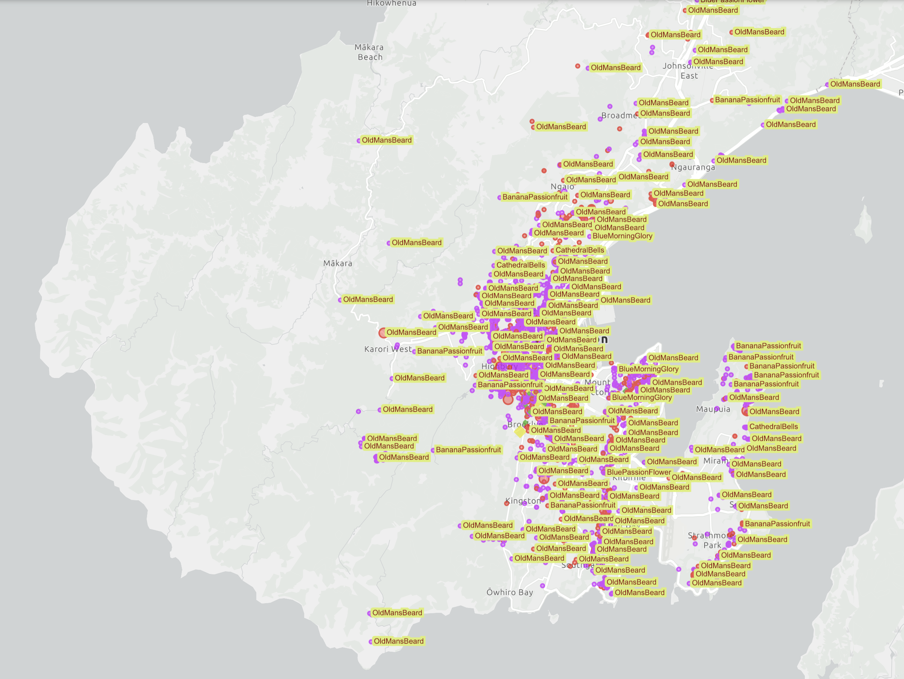

Hi! On our mission to make Wellington Old Man's Beard Free, we're using a map to manage and track our efforts in controlling the weed.

This video shows you how to use iNaturalist to add an Old Man's Beard patch to the map.

---


```md
## Using iNaturalist
```

We use iNaturalist, a citizen science platform, to report and update Old Man's Beard in Wellington.

---
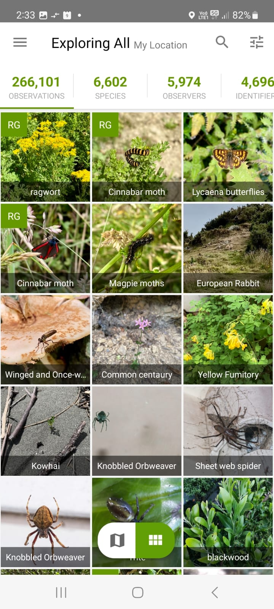

Install the iNaturalist app from the Play Store or App Store.

Allow access to Photos and Location, which are needed to report the weed.

Open the app, sign up and log in.

---


(callout:
  type: circle
  cx: 753
  cy: 75
  size: 52
)

To add a new observation, click on the menu icon,

---

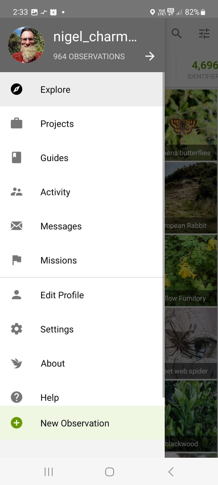

(callout:
  type: rectangle
  left: 726
  top: 909
  right: 979
  bottom: 969
)

and then click on New Observation.

---

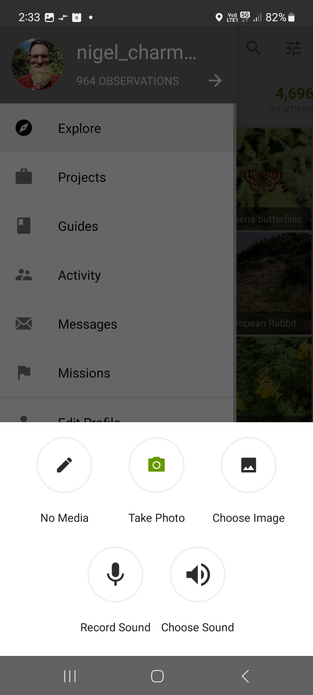

(callout:
  type: rectangle
  left: 726
  top: 909
  right: 979
  bottom: 969
)

Click on Take Photo,

(callout:
  type: circle
  cx: 959
  cy: 722
  size: 52
)

---

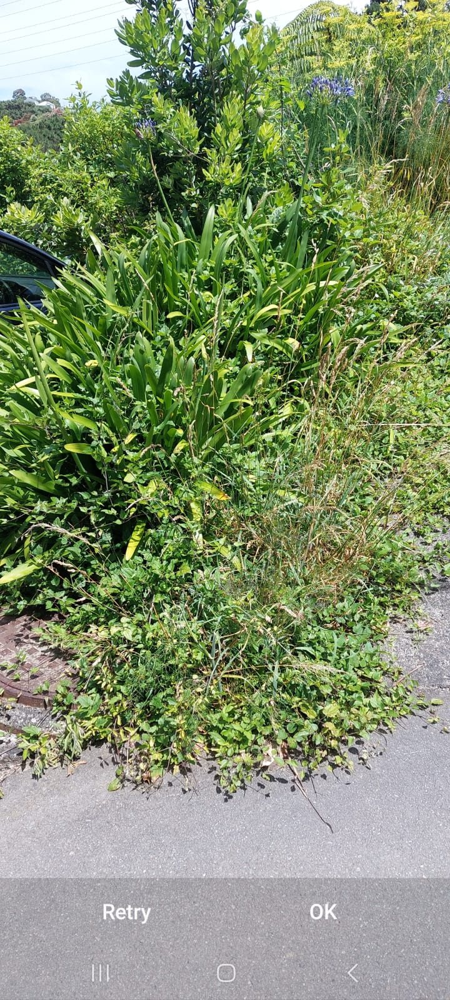

and take a photo of the Old Man's Beard,

---


(callout:
  type: circle
  cx: 1067
  cy: 981
  size: 52
)

then click OK.

---

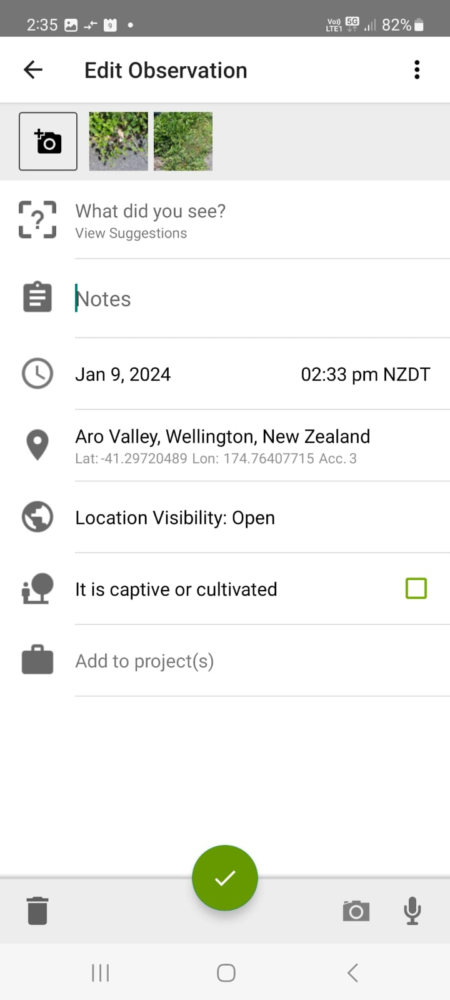

(callout:
  type: circle
  cx: 770
  cy: 154
  size: 52
)

Click on the Add Photo button to take additional photos.

---

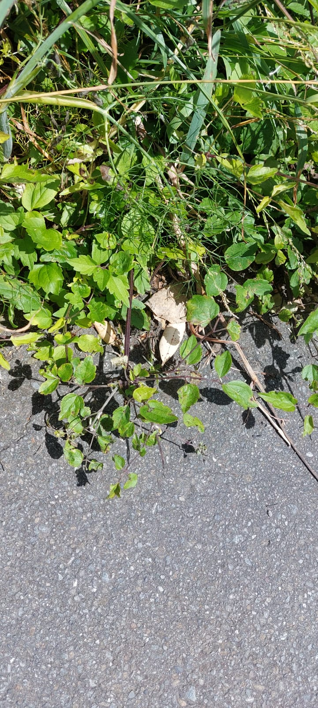

To help with identification and locating the patch in future, we recommend taking at least 2 photos.

Take a close-up of the vine 

---


and a photo of the entire patch if possible.

---


(callout:
  type: rectangle
  left: 724
  top: 201
  right: 975
  bottom: 274
)

To select the species, click on What did you see,

---

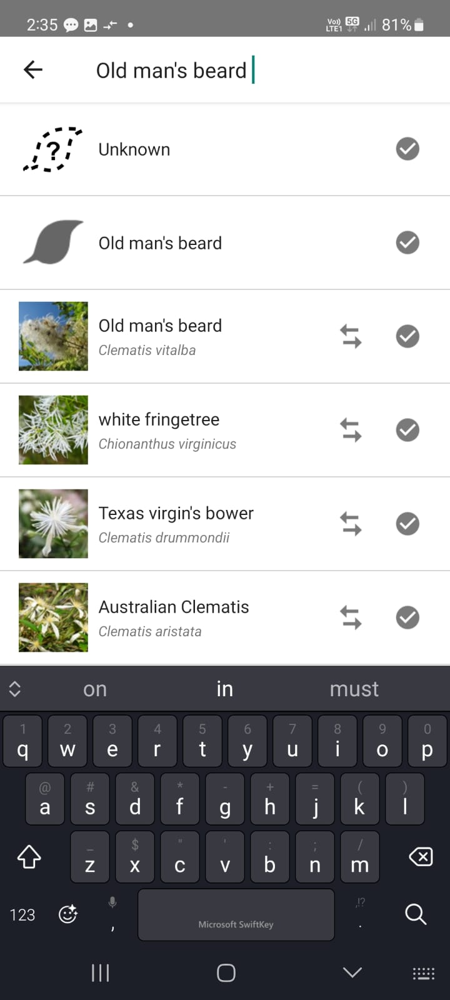

(callout:
  type: rectangle
  left: 801
  top: 45
  right: 1021
  bottom: 110
)

and then type in Old Man's Beard.

---


(callout:
  type: circle
  cx: 1156
  cy: 363
  size: 34
)

Click the tick icon next to Old Man's Beard (Clematis vitalba) to select it.

---


(callout:
  type: rectangle
  left: 731
  top: 442
  right: 1130
  bottom: 517
)

Check the location by clicking on the reported location. 

---

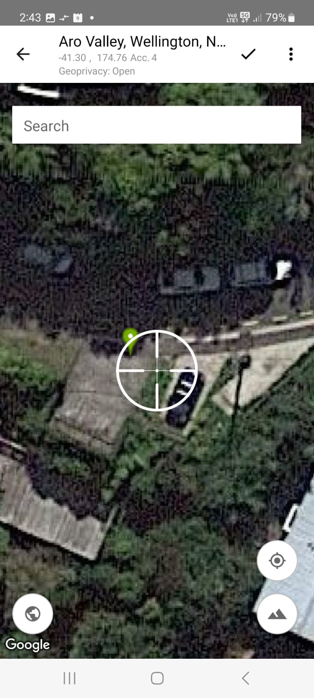

(callout:
  type: circle
  cx: 1144
  cy: 947
  size: 41
)

Move the map around and zoom in to get an accurate location. 

This is important so we can find the weed in future to control it.

It may be useful to switch to the Satellite view using the icon in the bottom right.

---


(callout:
  type: circle
  cx: 1099
  cy: 85
  size: 35
)

Then click the tick icon to update the location.

---


(callout:
  type: circle
  cx: 960
  cy: 947
  size: 49
)

Finally, select the tick icon to add the observation.

---

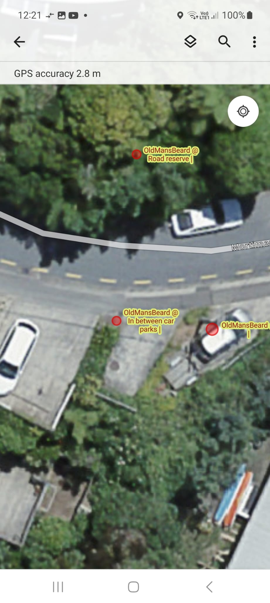

(callout:
  type: circle
  cx: 926
  cy: 574
  size: 35
)

The observation will be synchronised to our CAMS map within an hour.

Watch the `Using the CAMS weed map video` to see how to view and update it.

---

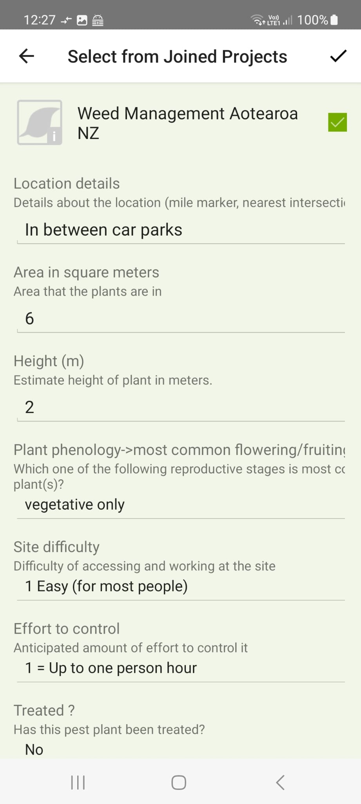

Advanced users could also add the observation to the `Weed Management Aotearoa NZ project` and fill in additional details.

These additional fields are used to manage the weed patch over time.

---


```md
## Please send feedback or questions to:

## [kiaora@ombfree.nz](mailto:kiaora@ombfree.nz)

&nbsp;
```

We hope this video has been useful.

> We hope this video has been useful.

Please email us questions or feedback at kiaora@`omb`free.nz.

> Please email us questions or feedback at kiaora@ombfree.nz.

Thanks for watching!

> Thanks for watching!