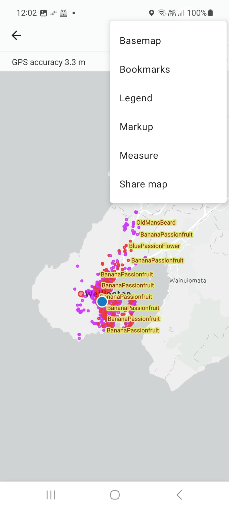

```md
# Updating Old Man's Beard status
```

(pause: 4)

---


Hi! On our mission to make Wellington Old Man's Beard Free, we've created a map to manage and track our efforts to control Old Man's Beard.

This map is colour coded to show which patches need control, which have been controlled, and which need checking. 

The weed status is reset to "Purple - Please Check" each Spring, so that we check for any regrowth or seedlings.

With over 3,000 reported Old Man's Beard patches, we can't check them all!

We'd love your help to check some of them and update this map. 

This video shows you how to find these patches and update their status.

---


```md
# Finding known weed patches
```

(pause: 2)

---


```md
## Open the **CAMS public device map** link in the description below
```

The first thing you need to do is install our map on your mobile device by clicking on the link in the description below. 

Opening the link will prompt you to install an application called ArcGIS Field Maps if you don't have it already.

Then open the link again and it will show the map. Select the option to enable location while using the app.

In future, you can just open Field Maps and it will show the map that you last opened.

---


You'll notice a lot of different coloured markers on the map. 

Each marker represents a weed patch and is coloured to show the current known status of the patch. 

---


(font-size: 80)

```md

* Purple - the patch needs checking
* Red - growth is occurring which needs controlling
* Yellow - the patch has been controlled this year
* Green - there is no regrowth this year
```

(font-size: 50)

The common colours are:

> The common colours are:

Purple. The patch needs checking.

> Purple - the patch needs checking

Red. Growth is occurring which needs controlling.

> Red - growth is occurring which needs controlling

Yellow. The patch has been controlled this year.

> Yellow - the patch has been controlled this year

Green. There is no regrowth this year.

> Green - there is no regrowth this year
  
---
(narration-mode: fragment)


(callout:
  type: circle
  cx: 1175
  cy: 76
  size: 40
)
To see a legend with the meaning of each colour, click on the vertical ellipses in the top right.

---


(callout:
  type: rectangle
  left: 960
  top: 180
  right: 1065
  bottom: 237
)
then select "Legend". 

---
(narration-mode: normal)


This shows the legend at the bottom of the page. 

Scroll down to see all the colours.

---


(callout:
  type: circle
  cx: 1166
  cy: 616
  size: 40
)
Click *X* to close the Legend.

---


(callout:
  type: circle
  cx: 1155
  cy: 200
  size: 40
)
To zoom into your location, click on the circle icon in the top right to centre the map. 

---


You may need to zoom in further to get a clearer view.

We're interested in updating the status of the "Purple - Please Check" dots.

---


Click on any of the purple Old Man's Beard symbols. The map shows multiple species, so make sure it's Old Man's Beard you've clicked on.

If there's a few weeds reported nearby, you'll see a list of all the weeds, so work through them one by one.

---
(video:
  file: Field Maps OMB.mp4
  segment: 00:07-00:16
  sync: match)

You'll see some basic information about the weed and possibly some location details.

The GPS position isn't always right, so you may need to hunt around a bit to find the Old Man's Beard.

If you need more info to help find it, click on the link under iNaturalist URL. 

This will open the iNaturalist page which will show more details including photos to help you find it.

---


```md
# Finding known weed patches in action
```

(pause: 2)

---
(video:
  file: OMB Mortimer.mp4
  segment: 00:00-00:23
  sync: match)

(voice: keith)

Let's try finding a known Old Man's Beard patch.

Once Field Maps has been installed, opening Field Maps will default to showing our CAMS map.

After zooming in to my current location, I see I need to walk down the road a bit to get to the Old Man's Beard patch.

---
(video:
  file: OMB Mortimer.mp4
  segment: 00:23-00:38
  sync: match)

(voice: keith)

I'm getting close, so I'll click on the icon to find out more details about this patch.

There's no location details, so I'll click on the iNaturalist URL to see a photo of it.

That looks like the bank across the road from me.

---
(video:
  file: OMB Mortimer.mp4
  segment: 00:46-00:55
  sync: match)

(voice: keith)

Let's click on the photo, so I can zoom in and see where the Old Man's Beard is in the photo.

There it is on the top right of the bank.

---


(voice: keith)

Looking around the bank now, the Old Man's Beard vines seem to have been mostly controlled. But I can see some regrowth at the top of the bank.

---


(voice: keith)

Walking around above the bank the new growth is a bit more clear.

I'll need to update the map to show that it is still alive. 

---


```md
# Updating the status of weed patches
```

(pause: 2)

---


In order to update an observation, you'll need to have an iNaturalist account. If you don't have one, sign up at iNaturalist.org.

---


```md
## [https://www.inaturalist.org/projects/weed-management-aotearoa-nz](https://www.inaturalist.org/projects/weed-management-aotearoa-nz)
```

You'll also need to be a member of the "Weed Management Aotearoa NZ" project on iNaturalist if you're not already.

Open the link shown above (which is also in the description below), then click on "Yes, I want to join".

---


```md
## Open the **CAMS public browser map** link - [cams.econet.nz/weed-app-browser-public](cams.econet.nz/weed-app-browser-public)
```

To update the weed status, you'll need to use a web browser. At the moment you can't do this on the mobile app.

Open the link shown above in a browser. The link is also in the description below. 

---
(video:
  file: Opening CAMS browser.mov
  segment: 00:00-00:01)

(pause: 1)

---
(video:
  file: Opening CAMS browser.mov
  segment: 00:01-00:10
  sync: match)

After agreeing to the terms and conditions, this will open the map.

---
(video:
  file: Opening CAMS browser.mov
  segment: 00:13-00:23
  sync: match)

We can either zoom and scroll or type in a nearby address to find the weed location. 

---
(video:
  file: Opening CAMS browser.mov
  segment: 00:23-00:33
  sync: match)

Having found it we click on the link next to the iNaturalist URL.

---
(video:
  file: Opening CAMS browser.mov
  segment: 00:33-00:39
  sync: match)

This opens up the iNaturalist observation that we need to update.

---
(video:
  file: Opening CAMS browser.mov
  segment: 00:39-00:39.1
  sync: match)

To update the observation you'll need to be logged in to an iNaturalist account. 

If you're not already, click on the link in the top right to Log In. 

---
(video:
  file: Updating observation.mov
  segment: 00:00-00:14
  sync: match)

Add the observation to the Weed Management Aotearoa NZ project, if it's not already added. 

To add it, type "Weed" into the "Add to a Project" field and select Weed Management Aotearoa NZ.

This observation is already part of the project so we click on the cog next to the project name and select the "Fill out project observation fields" option.

---
(video:
  file: Updating observation.mov
  segment: 00:14-00:43
  sync: match)

Update any of the fields that need modifying, clicking the Add button next to each modified field to save your changes.

---
(video:
  file: Updating observation.mov
  segment: 00:43-00:52
  sync: match)

At the bottom of the list, update the Status Update field to show whether it is now alive or dead and update the Date of Status Update field. 

Remember to click the Add button next to each changed field.

---


```md
# Controlling the weed
```

(pause: 2)

---
(video:
  file: Updating observation.mov
  segment: 00:40-00:40.1
  sync: match)

If you control the weed, please fill out at least the "Treated?", "Date controlled", "How treated" and "Treatment substance" fields. 

You don't need to update the "Status update" field in this case, the status will automatically change based on the treatment fields you have filled in.

---


---


```md
# Congratulations!
```

Congratulations!

You have now updated the status of this weed patch.

---


The map will be updated to show the new status within an hour after you've made the change.

You can check the updated map on either the mobile app or via the browser.

If it's not updated, check that you filled in the fields shown in this video. 

Also check you have clicked the Add button next to each modified field.

---


(callout:
  type: rectangle
  left: 896
  top: 615
  right: 1030
  bottom: 655
)
Checking this map, we see this dot has turned to "Red" to show there is active growth.

Updating the status might seem like a lot of work to start with, but it quickly becomes second nature.

In time, we hope to develop an app to make this easier on your mobile.

---


```md
## Please send feedback or questions to:

## [kiaora@ombfree.nz](mailto:kiaora@ombfree.nz)
```

We hope this video has been useful and you will help us update the status of our weed patches.

This will help us prioritise our work towards an Old Man's Beard Free Wellington.

---


```md
## Please send feedback or questions to:

## [kiaora@ombfree.nz](mailto:kiaora@ombfree.nz)
```

Please email us questions or feedback at kiaora@`omb`free.nz.

> Please email us questions or feedback at kiaora@ombfree.nz.

Thanks for watching!

> Thanks for watching!