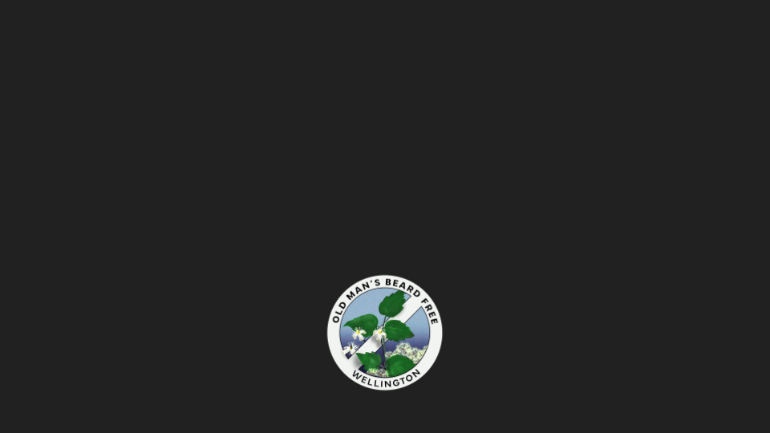
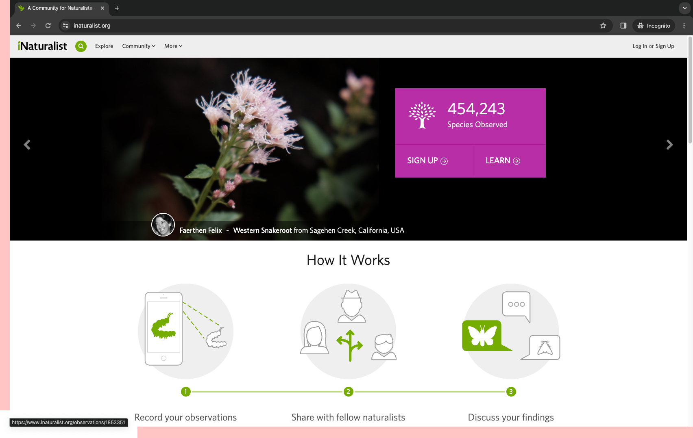
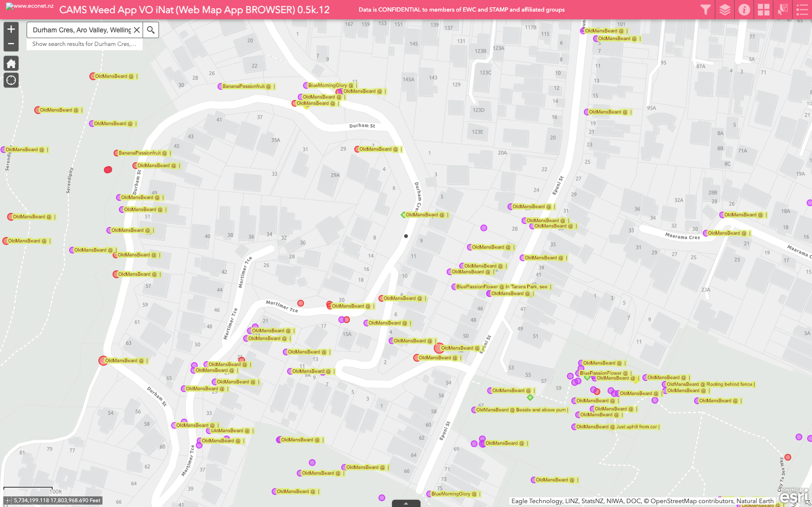

```md
# Updating Old Man's Beard status
```

(pause: 4)

We'd love your help to check Old Man's Beard patches and update their status.

See our previous video "Using the CAMS weed map" to find existing Old Man's Beard patches that need checking.

---


```md
## Using iNaturalist
```

We use iNaturalist, a citizen science platform, to report and update Old Man's Beard in Wellington.

<!-- Observations are synchronised hourly from iNaturalist to the CAMS weed map.

iNaturalist provides a mobile app and can be used via a browser. 

To update the status of weed patches, we need to use the browser version (you can only currently update your own observations on mobile). -->

---


In order to update an observation, you'll need to have an iNaturalist account. If you don't have one already, sign up at iNaturalist.org.

---


```md
### [https://www.inaturalist.org/projects/weed-management-aotearoa-nz](https://www.inaturalist.org/projects/weed-management-aotearoa-nz)
```

You'll also need to be a member of the Weed Management Aotearoa NZ project on iNaturalist if you're not already.

Open the link shown and then click on "Yes, I want to join".

The links in this video are also listed at ombfree.nz/maps.

---


```md
## Finding the iNaturalist observation via CAMS

### cams.econet.nz/weed-app-browser-public
```

The easiest way to find the iNaturalist observation is via CAMS.

Open the CAMS map on your browser using the link shown.

---
(video:
  file: CAMS Weed App browser.mov
  segment: 00:00-00:01)

(pause: 1)

---
(video:
  file: CAMS Weed App browser.mov
  segment: 00:01-00:10
  sync: match)

After agreeing to the terms and conditions, this will open the map.

---
(video:
  file: CAMS Weed App browser.mov
  segment: 00:13-00:23
  sync: match)

We can either zoom and scroll or enter a nearby address to find the weed location. 

---
(video:
  file: CAMS Weed App browser.mov
  segment: 00:23-00:33
  sync: match)

Having found it we click on the link next to the iNaturalist URL.

---
(video:
  file: CAMS Weed App browser.mov
  segment: 00:33-00:39
  sync: match)

This opens up the iNaturalist observation that we need to update.

---
(video:
  file: CAMS Weed App browser.mov
  segment: 00:39-00:39.1
  sync: match)

To update the observation you'll need to be logged in to your iNaturalist account. 

If you're not already, click on the link in the top right to Log In. 

---
(video:
  file: iNaturalist updating observation.mov
  segment: 00:00-00:14
  sync: match)

Add the observation to the Weed Management Aotearoa NZ project, if it's not already added. 

To add it, type *Weed* into the Add to a Project field and select Weed Management Aotearoa NZ.

This observation is already added to the project so we click on the cog next to the project name and select the *Fill out project observation fields* option.

---
(video:
  file: iNaturalist updating observation.mov
  segment: 00:14-00:43
  sync: match)

Update any of the fields that need modifying, clicking the Add button next to each modified field to save your changes.

---


```md
# Updating the status to Alive or Dead
```

(pause: 3)
---
(video:
  file: iNaturalist updating observation.mov
  segment: 00:43-00:52
  sync: match)

At the bottom of the list, update the Status Update field to show whether it is now alive or dead and update the Date of Status Update field. 

Remember to click the Add button next to each changed field.

---


```md
# Marking the weed patch as controlled
```

(pause: 3)

---
(video:
  file: iNaturalist updating observation.mov
  segment: 00:40-00:40.1
  sync: match)

If you have controlled the weed, please update at least the "Treated?", "Date controlled", "How treated" and "Treatment substance" fields. 

You don't need to update the "Status update" field in this case, the status will automatically change based on the treatment fields you have filled in.

---


```md
# Congratulations!
```

Congratulations!

You have now updated the status of this weed patch.

---



The map will be updated to show the new status within an hour after you've made the change.

You can check the updated map on either the mobile app or via the browser.

If it's not updated, check that you filled in the fields shown in this video. 

Also check you have clicked the Add button next to each modified field.

---


(callout:
  type: rectangle
  left: 896
  top: 615
  right: 1030
  bottom: 655
)
Checking the map after an hour, we see this dot has turned to "Red" to show there is active growth.

Updating the status might seem like a lot of work to start with, but it quickly becomes second nature.

In time, we hope to develop a mobile app to make this easier.

---


```md
## Please send feedback or questions to:

## [kiaora@ombfree.nz](mailto:kiaora@ombfree.nz)
```

We hope this video has been useful.

> We hope this video has been useful.

See also our video on adding a new Old Man's Beard patch to the map.

> See also our video on adding a new Old Man's Beard patch to the map.

Please email us questions or feedback at kiaora@`omb`free.nz.

> Please email us questions or feedback at kiaora@ombfree.nz.

Thanks for watching!

> Thanks for watching!